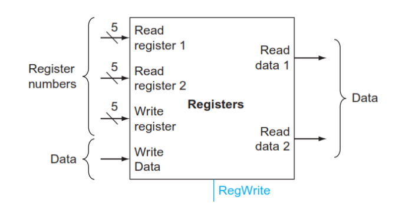
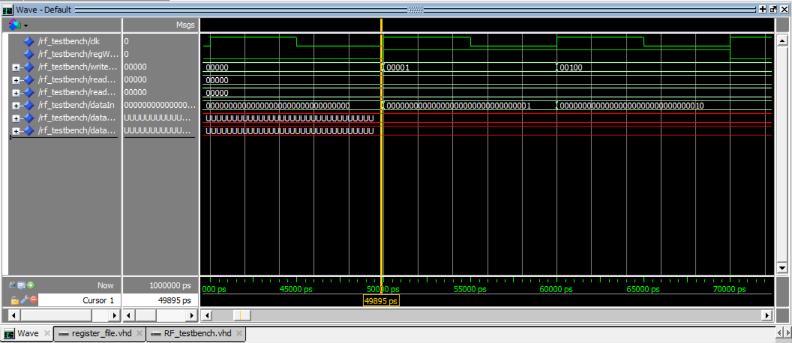
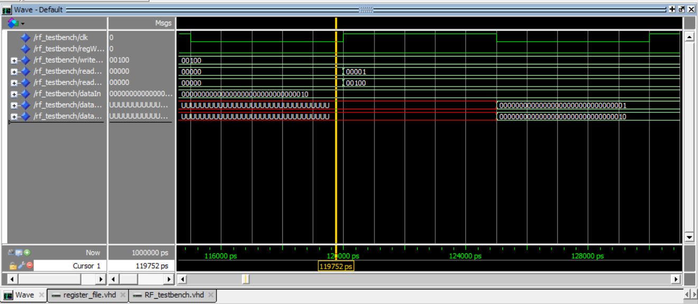
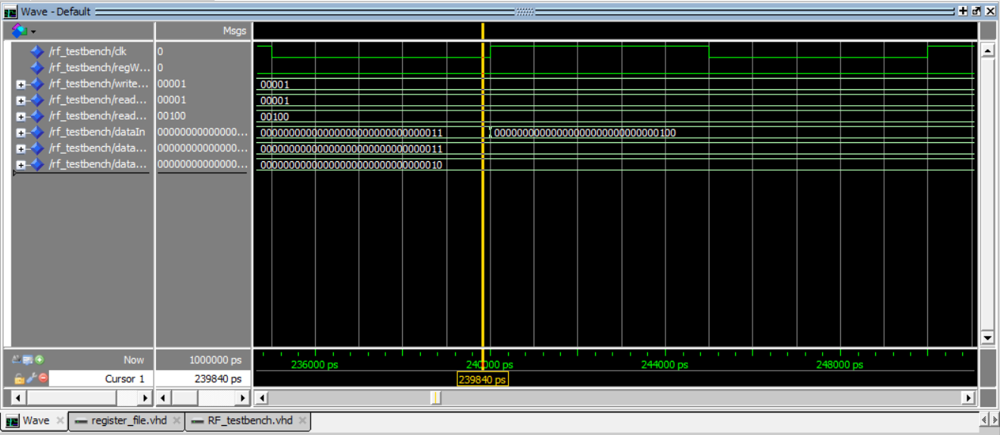

## Register File Design 
### Introduction
- **Objective**: Implement a register file in VHDL consisting of 32 registers to facilitate read and write operations on data.

- **Input Signals**:
  - Three 5-bit register numbers: Two for specifying read registers and one for the write register.
  - 32-bit data input for write operation.
  - `RegWrite` control line to enable writing to the register file.
  - Clock signal for synchronization.
- **Output Signals**:
  - Two 32-bit data outputs corresponding to the read registers specified.
- **Operation**:
  - Write operations occur in the first half cycle of the clock signal.
  - Read operations occur in the second half cycle of the clock signal.

### Entity Description
The entity `RegisterFile` defines a register file module. It has the following ports:
- `clk`: Clock input signal.
- `regWrite`: Write control signal.
- `writeRegNum`: Write register address.
- `readRegNum1`: Read register address 1.
- `readRegNum2`: Read register address 2.
- `dataIn`: Data input for write operation.
- `dataOut1`: Data output for read operation 1.
- `dataOut2`: Data output for read operation 2.

### Architecture Description
The architecture `Behavioral` implements the register file functionality. It consists of a single process sensitive to the rising edge of the clock signal. The process handles both write and read operations based on the `regWrite` control signal and the clock edge.

#### Write Phase
- On a rising clock edge, if `regWrite` is asserted (`'1'`), the process writes the `dataIn` to the register specified by `writeRegNum`.

#### Read Phase
- On a falling clock edge, the process reads data from the registers specified by `readRegNum1` and `readRegNum2` and assigns them to `dataOut1` and `dataOut2` respectively.

### Implementation Details
- The register file is implemented as an array of 32-bit vectors (`RegisterArray`).
- The write operation occurs on the rising edge of the clock, while the read operation occurs on the falling edge.

## Test Bench for Register File  

### Test Case 1: Write to Register 1 and 4
- **Description**: Writes data to registers 1 and 4.
- **Write Operations**:
  - Write to register 1: Data `00000001` is written.
  - Write to register 4: Data `00000002` is written.

### Test Case 2: Read from Registers 1 and 4
- **Description**: Reads data from registers 1 and 4.
- **Read Operations**:
  - Read from register 1: Data output from register 1.
  - Read from register 4: Data output from register 4.

### Test Case 3: Write and Read in Same Register at Same Clock Cycle
- **Description**: Writes and reads data from register 1 in the same clock cycle.
- **Write Operation**:
  - Write to register 1: Data `00000003` is written.
- **Read Operations**:  
  - Read from register 1: Data output from register 1.

### Test Case 4: Write when `regWrite = 0`
- **Description**: Attempts to write data to register when `regWrite` is low.
- **Write Operation**:
  - No write operation should occur as `regWrite` is low.

## Samples of Run

#### Test Case 1: Write to Register 1 and 4

- **Expected Result**: Data `00000001` should be written to register 1, and data `00000002` should be written to register 4.

- **Comment**: This test case verifies the ability of the register file to correctly write data to specified registers.

#### Test Case 2: Read from Registers 1 and 4
- **Expected Result**: Data stored in registers 1 and 4 should be read and output in the second half cycle.

- **Comment**: This test case ensures that the register file can properly read data from specified registers in the second half cycle.

#### Test Case 3: Write and Read in Same Register at Same Clock Cycle
- **Expected Result**: Data `00000003` should be written to register 1, and then read from register 1 in the same clock cycle.

- **Comment**: This test case validates whether the register file can handle simultaneous write and read operations on the same register within a single clock cycle.

#### Test Case 4: Write when `regWrite = 0`
- **Expected Result**: No data should be written to any register since `regWrite` is low.

- **Comment**: This test case checks if the register file correctly ignores write operations when the `regWrite` control line is de-asserted.

