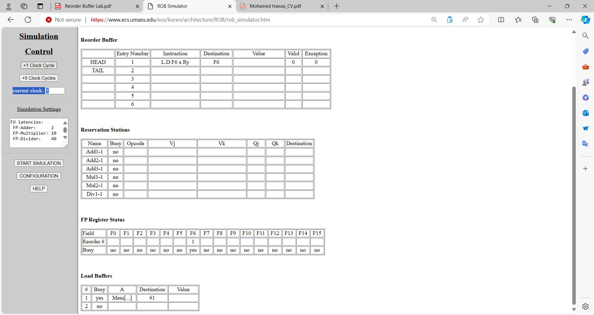

# It is required to come up with two different instruction sets (of no less than 5 instructions each)

## case 1 : Strength of ROB

One that shows the strengths of the reorder buffer technique. That is, show how it could enable multiple, simultaneous execution of different instructions on different functional units.

## Simulation

### Configuration

### Cycle 01

### Cycle 02

### Cycle 03

### Cycle 05

### Cycle 06

### Cycle 07

### Cycle 08

### Cycle 11

### Cycle 16

### Cycle 17

### Cycle 18

### Cycle 57

### Last Cycle 58

### Cycle 59

## Case 2 : ROB does not help

One where the reorder buffer does not help. For example, where the instructions go to the same functional unit.

## Simulation

### Configuration

### Cycle 01

### Cycle 02

### Cycle 04

### Cycle 05

### Cycle 06

### Cycle 07

### Cycle 08

### Cycle 09

### Cycle 11

### Cycle 12

### Last Cycle 14

### Cycle 15

